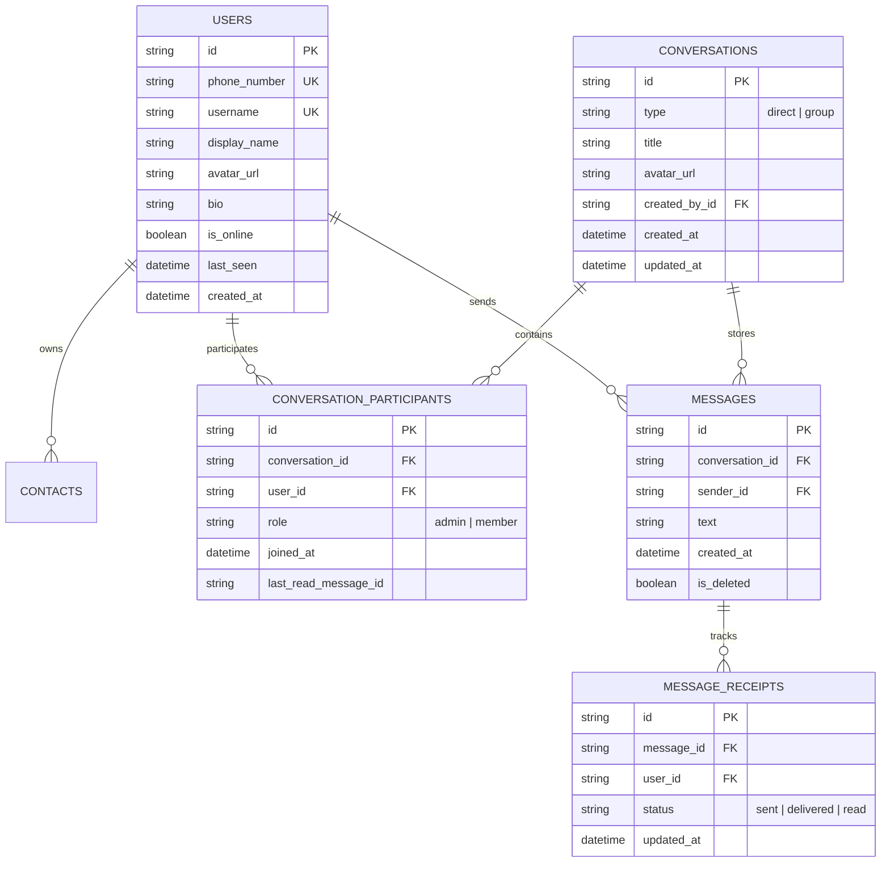

# Signal Clone — Final Architecture & Implementation Plan

> **Final Update**: 
> 1. Removed all encryption/security banners (`SignalSecurityBanner.tsx` omitted). E2EE is documented in README as outside assignment scope.
> 2. Enforced **Code Simplicity & Explainability Guidelines**: simple, readable, non-abstract FastAPI + SQLAlchemy + Next.js code that can be easily explained line-by-line during the interview.

---

## 1. Core Requirements & Verification Matrix

| Category | Requirement | Status / Approach |
| :--- | :--- | :--- |
| **Auth & Onboarding** | Mocked OTP Login / Register (`123456` OTP) | 1-click preset logins + manual phone/username auth |
| | Profile setup (Display name, avatar picker, bio) | Stored in SQLite `users` table |
| | Session persistence & Logout | JWT token stored in localStorage + HTTP headers |
| **Contacts & Chat List**| Left sidebar conversation list | Sorted by `updated_at`, last message snippet, timestamp, unread badge |
| | Contact Search & Add Contact | Search by phone/username, instant contact addition |
| | Online / Last Seen Indicators | Real-time WebSocket presence updates |
| **1-on-1 Messaging** | Real-time direct text messaging | FastAPI WebSockets + SQLite persistence |
| | Delivery & Read Receipts | ⌛ Sending -> ✓ Sent -> ✓✓ Delivered -> 🔵 Read state tracking |
| | Typing Indicators | Live `typing:start` / `typing:stop` event broadcast |
| | Timestamps & Date Separators | Standardized human-formatted timestamps ("Today", "Yesterday", 12h time) |
| **Group Messaging** | Create Group (Name, Avatar, Select Members) | Simple modals for creation & member management |
| | Group Member View & Admin Controls | Add/remove members, admin roles |
| | Group Chat Messaging | Real-time broadcasting to all active group members |
| **Signal UI / UX** | Visually convincing Signal-inspired UI/UX | Clean Signal dark theme (`#121212`, `#1E1E22`, `#2C6BED`) |
| | Security Banner | **Omitted completely** (Explained in README) |
| **Testing Protocol** | Multi-browser simultaneous WebSocket testing | Dual-browser automated/manual verification (Alice & Bob) |
| **Bonus Features (Deferred)**| Attachments, Reactions, Quoted Replies, Disappearing Messages, Shortcuts | **Deferred until ALL core features are 100% complete and verified** |

---

## 2. Clean & Explainable Architecture

```
ScalarLabs/
├── backend/
│   ├── main.py                  # FastAPI app entry point, CORS, REST & WS router mounts
│   ├── database.py              # SQLite connection setup (SQLAlchemy Session & Base)
│   ├── models.py                # Plain ORM models (User, Contact, Conversation, Participant, Message, Receipt)
│   ├── schemas.py               # Pydantic schemas for request/response bodies
│   ├── auth.py                  # Simple JWT creation, verification & password hash helpers
│   ├── websocket_manager.py     # ConnectionManager dict mapping user_id -> List[WebSocket]
│   ├── seed.py                  # Simple script to seed demo users (Alice, Bob, Charlie, Diana) & active chats
│   └── routers/
│       ├── auth_router.py       # Login & Register REST endpoints
│       ├── users_router.py      # Users search & profile edit
│       ├── contacts_router.py   # List contacts & Add contact
│       ├── conversations_router.py # List chats & create 1-on-1 / group chats
│       ├── messages_router.py   # Fetch message history
│       └── groups_router.py     # Add/remove group members
│
├── frontend/
│   ├── app/                     # Next.js App Router
│   │   ├── page.tsx             # Main Signal Chat dashboard layout
│   │   ├── login/page.tsx       # Auth page with 1-click Quick Login buttons
│   │   ├── layout.tsx           # Global layout & fonts
│   │   └── globals.css          # Tailwind & Signal dark theme colors (`#121212`, `#1E1E22`, `#2C6BED`)
│   ├── components/
│   │   ├── sidebar/             # Sidebar header, search input, conversation list items
│   │   ├── chat/                # Active chat header, message thread view, input composer
│   │   └── modals/              # New Chat, New Group, Group Admin Details, Settings
│   ├── context/
│   │   ├── AuthContext.tsx      # Auth user state & JWT token helper
│   │   ├── WebSocketContext.tsx # Central WebSocket connection & message listener hub
│   │   └── ChatContext.tsx       # Active chat state, messages list, typing indicators map
│   └── lib/
│       ├── api.ts               # Simple fetch API wrapper with Authorization headers
│       └── utils.ts             # Time formatters ("Today", "10:45 AM") & user avatar initials helper
│
└── README.md                    # Setup guide, Architecture overview, Database schema, API reference
```

---

## 3. SQLite Relational Database Schema



---

## 4. 17-Step Core-First Implementation Order

1. **Step 1: Project Setup**: Create `backend/` and `frontend/` workspaces, install FastAPI, SQLAlchemy, Uvicorn, Next.js, Tailwind CSS, Lucide icons.
2. **Step 2: SQLite Database & Models**: Write `database.py` and `models.py` for Users, Contacts, Conversations, Participants, Messages, Receipts.
3. **Step 3: Authentication & Session**: Write `auth.py` and `auth_router.py` for mocked OTP verification (`123456`), password hashing, and JWT token issue.
4. **Step 4: Seed Users & Demo Data**: Write `seed.py` to populate 4 demo accounts (**Alice**, **Bob**, **Charlie**, **Diana**), contacts, and active 1-on-1 & group chats.
5. **Step 5: REST APIs**: Build simple endpoints for fetching conversations, user search, adding contacts, fetching message history.
6. **Step 6: WebSocket Infrastructure**: Create `websocket_manager.py` with `ConnectionManager` class to broadcast messages by user connection mapping.
7. **Step 7: 1-on-1 Real-Time Messaging**: Connect frontend `WebSocketContext` with backend `/ws?token=...` endpoint for live text messaging.
8. **Step 8: Message Status & Typing Indicators**: Implement live checkmarks (`sending` ➔ `sent` ➔ `delivered` ➔ `read`) and `is typing...` status broadcast.
9. **Step 9: Conversation List & Search**: Wire left sidebar list, active search input, unread count badges, and recent message snippets.
10. **Step 10: Group Creation & Messaging**: Build New Group modal, group message broadcasting, and member view.
11. **Step 11: Group Member Management**: Build Admin controls to add and remove group members in real time.
12. **Step 12: Signal UI Refinement**: Apply Signal dark mode theme (`#121212`, `#1E1E22`, `#2C6BED`), rounded chat bubbles, header toolbar.
13. **Step 13: Dual-Browser Real-Time Testing**: Launch Alice in Browser 1 and Bob in Browser 2. Test live messaging, receipts, typing indicators, and group updates.
14. **Step 14: Bug Fixing & Edge Cases**: Handle empty states, loading indicators, WS reconnection handling, input validation.
15. **Step 15: Comprehensive README**: Document architecture, setup commands, schema, API endpoints, and design decisions for evaluation.
16. **Step 16: Deployment Preparation**: Ensure local dev servers run smoothly with `npm run dev` and `uvicorn main:app --reload`.
17. **Step 17: Optional Bonus Features**: Consider optional attachments/reactions/quoted replies if time permits.
