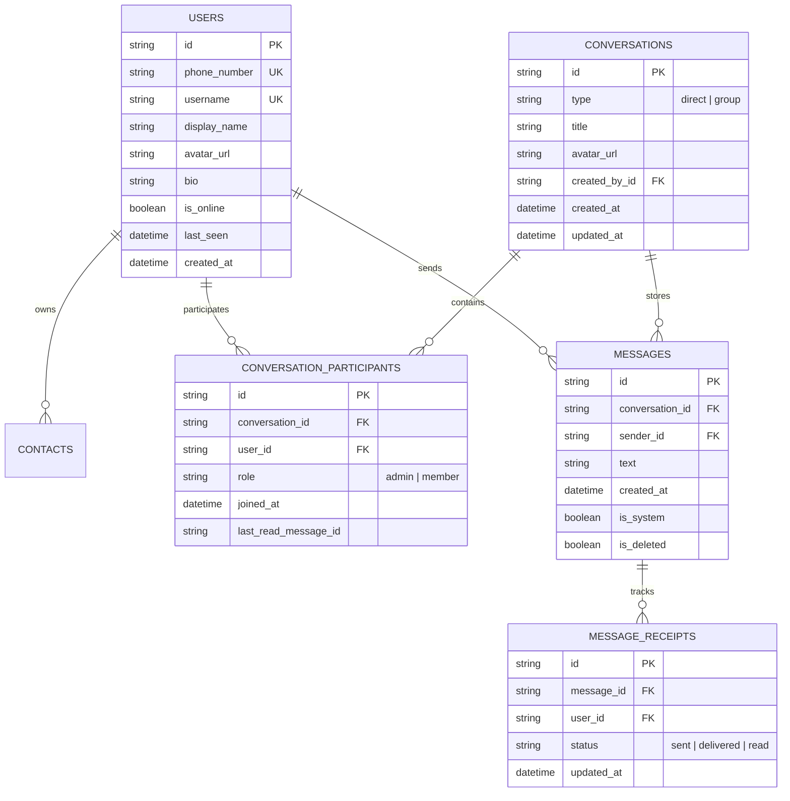

# 🚀 Signal Messenger Clone — Complete Architecture, System Design & Feature Plan

---

## 📌 Executive Overview

This application is a **full-stack, real-time Signal Messenger clone** engineered with **FastAPI (Python)** on the backend, **Next.js 14 / React (TypeScript)** on the frontend, **WebSockets** for instant real-time event broadcasting, and **PostgreSQL / SQLite** with SQLAlchemy ORM for data persistence.

---

## 📑 Table of Contents
1. [Core Features & System Implementation Status](#1-core-features--system-implementation-status)
2. [End-to-End System Architecture & Data Flow](#2-end-to-end-system-architecture--data-flow)
3. [Database Schema & Table Relationships](#3-database-schema--table-relationships)
4. [Group Messaging & Member Controls Architecture](#4-group-messaging--member-controls-architecture)
5. [System Event Messages & User Message Safeguards](#5-system-event-messages--user-message-safeguards)
6. [Real-Time WebSocket Protocol & Event Matrix](#6-real-time-websocket-protocol--event-matrix)
7. [Cloud Deployment & Verification Matrix](#7-cloud-deployment--verification-matrix)
8. [Interview Walkthrough Guide (How to Explain the App)](#8-interview-walkthrough-guide-how-to-explain-the-app)

---

## 1. Core Features & System Implementation Status

| Feature | Detailed Description | Implementation Status |
| :--- | :--- | :---: |
| **Authentication & Onboarding** | OTP-based authentication (`123456`), 1-click Quick Login presets (Alice, Bob, Charlie, Diana), JWT token authentication stored in `localStorage`. | ✅ Completed |
| **Contacts & Direct Messaging** | 1-on-1 real-time direct chats, live contact search, contact add/nickname support. | ✅ Completed |
| **Message Receipts & Read Tracking** | 3-stage delivery receipts: `⌛ Sending` ➔ `✓ Sent` ➔ `✓✓ Delivered` ➔ `🔵` Electric Cyan (`#00E5FF`) Read Receipts. | ✅ Completed |
| **Live Typing Indicators** | WebSockets broadcast `typing:start` and `typing:stop` events live across active chat participants. | ✅ Completed |
| **Real-Time Online Presence** | Instant `user:status` events broadcast user online/offline status live over WebSockets across browsers without needing page reloads. | ✅ Completed |
| **Group Creation & Admin Setup** | Users can create custom named groups. Creator is automatically assigned as **Group Admin** and excluded from member picker. | ✅ Completed |
| **Group Member Controls** | Admins can view group members, **Add Members** from contacts, and **Remove Members** (kick out). Members can view and leave groups. | ✅ Completed |
| **Group System Event Messages** | Automatic system notifications (`📌`) generated and formatted as centered pill badges when groups are created, members added, removed, or leave. | ✅ Completed |
| **System Event vs User Message Safeguard** | Backend flags system events with `is_system: true` metadata tag so normal user messages starting with `📌` are never misclassified. | ✅ Completed |
| **Cloud Deployment** | Backend + PostgreSQL database running on Railway; Frontend deployed on Vercel; synced with GitHub repository. | ✅ Completed |

---

## 2. End-to-End System Architecture & Data Flow

```
+-------------------------------------------------------------------------+
|                              FRONTEND                                   |
|                  Next.js 14 + Tailwind CSS + WebSockets                 |
|                                                                         |
|   +-------------------+    +---------------------+    +-------------+   |
|   |   AuthContext     |    |   WebSocketContext  |    | ChatContext |   |
|   | (JWT / User State)|    |  (Live Event Hub)   |    | (Active Chat|   |
|   +---------+---------+    +----------+----------+    +------+------+   |
+-------------|-------------------------|----------------------|----------+
              | REST (HTTPS)            | WebSocket (WSS)      | REST (HTTPS)
              v                         v                      v
+-------------------------------------------------------------------------+
|                              BACKEND                                    |
|                   FastAPI + Uvicorn + SQLAlchemy                        |
|                                                                         |
|   +-------------------+    +---------------------+    +-------------+   |
|   |   Auth Router     |    | Connection Manager  |    | REST Routers|   |
|   | (/api/auth)       |    | (/ws?token=...)     |    | (Groups/Msg)|   |
|   +---------+---------+    +----------+----------+    +------+------+   |
+-------------|-------------------------|----------------------|----------+
              |                         |                      |
              +-------------------------+----------------------+
                                        |
                                        v
+-------------------------------------------------------------------------+
|                              DATABASE                                   |
|                     PostgreSQL (Railway) / SQLite                       |
|   Tables: users, contacts, conversations, conversation_participants,     |
|           messages, message_receipts                                    |
+-------------------------------------------------------------------------+
```

---

## 3. Database Schema & Table Relationships



### Table Details & Relationship Explanation:

1. **`users` Table**:
   * Stores user credentials, profile attributes (`display_name`, `avatar_url`, `bio`), and real-time status (`is_online`, `last_seen`).
2. **`conversations` Table**:
   * Holds both 1-on-1 direct chats (`type="direct"`) and multi-user group chats (`type="group"`).
   * Group chats have `title`, `avatar_url`, and `created_by_id` referencing the creator user.
3. **`conversation_participants` Table** (Junction Table):
   * Connects `users` to `conversations`.
   * Tracks user roles (`admin` or `member`), `joined_at` timestamps, and `last_read_message_id`.
4. **`messages` Table**:
   * Stores message text, sender reference (`sender_id`), conversation reference (`conversation_id`), and timestamp.
   * Also stores **System Notification Messages** (e.g. `📌 Alice added Bob to the group`).
5. **`message_receipts` Table**:
   * Tracks per-recipient message delivery and read status (`sent`, `delivered`, `read`).

---

## 4. Group Messaging & Member Controls Architecture

### Group Lifecycle & Actions:

1. **Group Creation (`POST /api/groups/create`)**:
   * Client sends group `title` and array of selected `member_user_ids`.
   * Creator is automatically assigned `role="admin"` in `conversation_participants`.
   * System generates initial event message: `📌 <Creator> created group "<Title>"`.

2. **Add Group Members (`POST /api/groups/{id}/members`)**:
   * Authorized by group membership check.
   * Appends new rows to `conversation_participants` with `role="member"`.
   * System generates notification message: `📌 <Admin> added <Member1, Member2> to the group`.

3. **Remove Group Member (`DELETE /api/groups/{id}/members/{user_id}`)**:
   * Role enforcement: Non-admins can only remove themselves (leave group); admins can remove any member.
   * Deletes target user's row from `conversation_participants`.
   * System generates notification message:
     * If self-leave: `📌 <User> left the group`
     * If admin kick: `📌 <Admin> removed <User> from the group`

---

## 5. System Event Messages & User Message Safeguards

### How System Messages are Distinguished from User Messages:

* **Backend Metadata Flag (`is_system: bool`)**:
  System events generated by the backend API are marked with `is_system: true`.
* **User Messages (`is_system: false`)**:
  If a regular user types a chat message starting with `📌` (e.g. `"📌 Here is the link"`), it is sent with `is_system: false`.
* **Frontend Rendering Logic (`ChatPane.tsx`)**:
  ```tsx
  const isSystemMessage = Boolean(msg.is_system);

  if (isSystemMessage) {
    // Render as centered system notification pill badge
  } else {
    // Render as normal left/right user chat bubble
  }
  ```

---

## 6. Real-Time WebSocket Protocol & Event Matrix

| Event Type | Payload Data | Direction | System Action |
| :--- | :--- | :--- | :--- |
| `message:send` | `{ conversation_id, text }` | Client ➔ Server | Persists message & receipts in DB; broadcasts `message:new` to online participants. |
| `message:new` | Message object with sender info & receipts | Server ➔ Clients | Appends message to active chat thread; updates sidebar last message snippet & unread count. |
| `message:read` | `{ conversation_id, message_ids }` | Client ➔ Server | Updates `message_receipts` status to `read`; broadcasts `receipt:update` to senders. |
| `typing:start` | `{ conversation_id }` | Client ➔ Server | Broadcasts typing state to other participants in the conversation. |
| `typing:stop` | `{ conversation_id }` | Client ➔ Server | Clears typing indicator for the active user. |
| `user:status` | `{ user_id, is_online, last_seen }` | Server ➔ Clients | Broadcasted on socket connect/disconnect; updates live green online status dot immediately. |

---

## 7. Cloud Deployment & Verification Matrix

* **GitHub Repository**: [vamsi-krishna-katakam/signal-messenger](https://github.com/vamsi-krishna-katakam/signal-messenger.git)
* **Backend Deployment**: Railway (`https://signal-messenger-production.up.railway.app`)
* **Database Deployment**: PostgreSQL instance hosted on Railway
* **Frontend Deployment**: Vercel (`NEXT_PUBLIC_API_URL` pointing to Railway production server)

---

## 8. Interview Walkthrough Guide (How to Explain the App)

When presenting this project to interviewers or evaluators, follow this 4-step sequence:

1. **Architecture & Tech Stack Summary**:
   > *"I built a Signal Messenger clone using Next.js on the frontend and FastAPI on the backend, using WebSockets for bidirectional real-time communication and PostgreSQL for persistence."*

2. **Real-Time Data Pipeline**:
   > *"When a user logs in, a persistent WebSocket connection is established using a JWT token. When a message is typed, a `typing:start` event is emitted. When sent, the server saves the message and receipt models to PostgreSQL and broadcasts `message:new` to all online participants instantly."*

3. **Group Admin Controls & System Events**:
   > *"Groups support role-based access. Group creators are automatically assigned as Admins. Admins can view members, add new contacts, or remove existing members. Whenever a member is added, removed, or leaves, the system automatically inserts a system event message (`📌`) tagged with `is_system: true` that renders as a centered pill badge in the UI."*

4. **Performance & Scalability Considerations**:
   > *"To avoid connection pool starvation on WebSockets, DB sessions are scoped per event execution using `with SessionLocal() as db:`, keeping pooled connections lightweight and scale-ready."*
